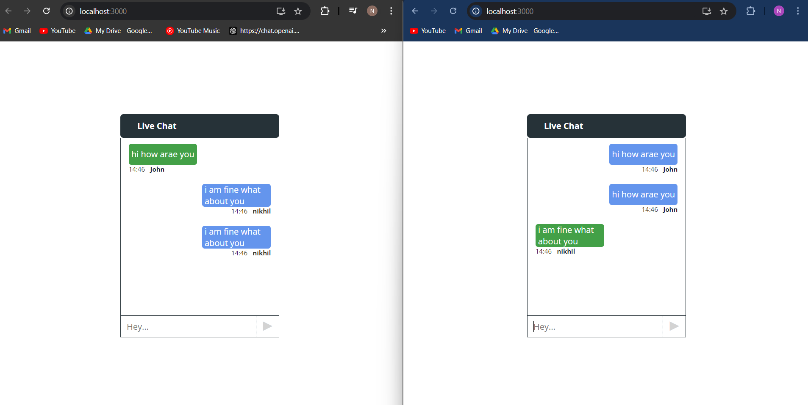

# Chat App

This is a simple real-time chat application that allows users to communicate over the network. The app consists of a **client** and a **server** that work together to send and receive messages.

## Features
- Real-time chat between multiple clients.
- Support for private messaging.
- Message broadcasting to all connected clients.
- Server manages and handles multiple client connections.

  ## Screenshots

### Join a Chat Interface


### User Joining Chat in Two Browsers


### Live Chat Interface


## Folder Structure

```bash
.
├── client
│   ├── client_code.cpp
│   ├── utils.h
│   ├── Makefile
│   └── README.md
├── server
│   ├── server_code.cpp
│   ├── utils.h
│   ├── Makefile
│   └── README.md
├── README.md
└── LICENSE
```
- **client/**: Contains the code for the client-side of the chat application.
- **server/**: Contains the code for the server-side of the chat application.

## Prerequisites

- C++ compiler (e.g., `g++`)
- Make

## How to Run

### Server

1. Navigate to the `server` directory:

    ```bash
    cd server
    ```

2. install packages:

    ```bash
    npm i
    ```

3. Run the server:

    ```bash
    npm start
    ```

### Client

1. Navigate to the `client` directory:

    ```bash
    cd client
    ```

2. Install the nodemdules:

    ```bash
    npm i
    ```

3. Run the client:

    ```bash
    npm run start
    ```

4. Enter the server IP address and port to connect to the server.

## Contribution

Feel free to fork this repository and create pull requests to improve the project. For major changes, please open an issue first to discuss what you would like to change.

## License

This project is licensed under the MIT License - see the [LICENSE](LICENSE) file for details.

## Author

[Niksha29](https://github.com/Niksha29)

